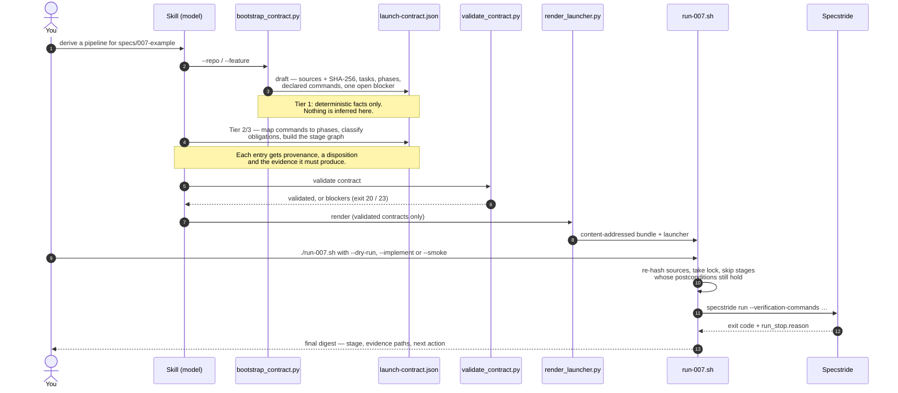
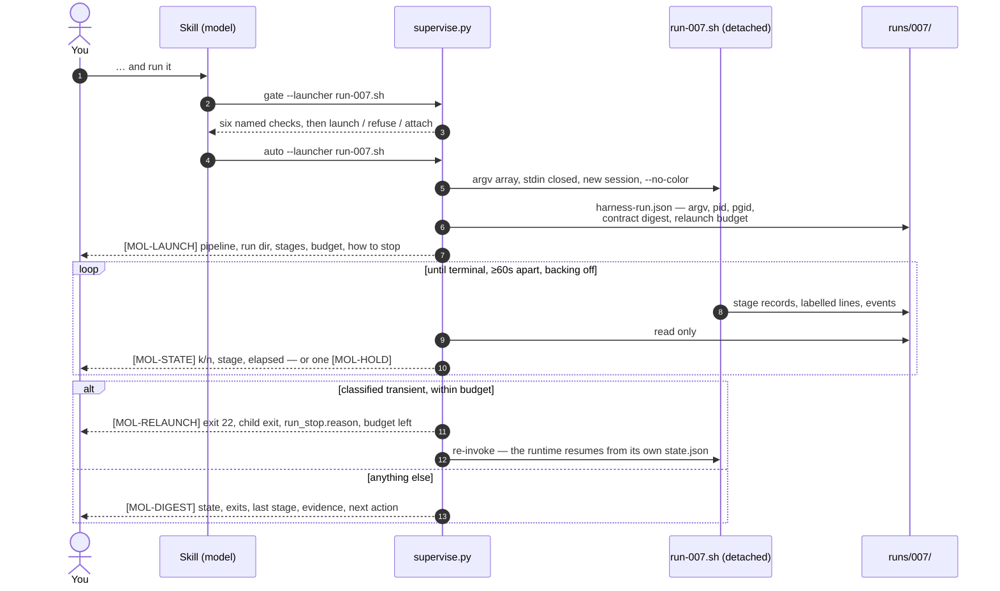

# mixture-of-loops

[](https://github.com/mairp/mixture-of-loops/actions/workflows/ci.yml)

`mixture-of-loops` is one maintained Agent Skills package for Claude Code, Codex,
DeepSeek Harness (dsh), pi, and prime (Prime Intellect's pi-based agent). It reads Spec Kit feature artifacts holistically and
generates a provenance-bound launch contract plus an executable, unattended Specstride
pipeline.

Specstride was formerly Wiggum: contracts that still use the
`wiggum` stage kind keep validating with a deprecation warning and launch `specstride run`.

The canonical skill is [skills/mixture-of-loops/SKILL.md](skills/mixture-of-loops/SKILL.md).
All five harnesses link to that directory so fixes do not drift between copies.

## Use

Invoke the skill from a repository that contains one or more Spec Kit feature directories:

```text
# Codex
$mixture-of-loops derive a pipeline for specs/007-example

# Claude Code or dsh
/mixture-of-loops derive a pipeline for specs/007-example

# pi or prime
/skill:mixture-of-loops derive a pipeline for specs/007-example
```

A plain request that matches the skill description also works where the harness offers
description-based invocation (Codex, Claude Code, pi, prime, dsh).

The skill inventories the supplied feature artifacts, records their provenance in a launch
contract, validates the contract, and renders a Bash launcher.

### Three modes

Generation is the default, and silence is never consent to execute:

```text
# generate (default): derive, validate, render, bash -n, --dry-run. Nothing runs.
/mixture-of-loops derive a pipeline for specs/007-example

# run: execute a launcher that already exists. No re-derivation, no re-render.
/mixture-of-loops run the pipeline for specs/007-example

# auto: generate, then run if and only if the launch gate passes.
/mixture-of-loops derive a pipeline for specs/007-example and run it
```

An explicit `--auto`, `--run` or `--generate` token in the invocation wins over the prose,
and "just derive it" or "don't run it" always stays in `generate`. `--implement` and
`--smoke` reach the launcher only when the request asks for them; `--dry-run` never travels
with `run` or `auto`, because it is the generation gate rather than an execution mode.

In `run` and `auto` the harness starts the launcher **detached** — stdin closed, its own
session, colour off, both streams to a log beside the run state — and then supervises it by
reading the run's own telemetry until it terminates. It reports the stage position, the
elapsed times and any recovery detail while the run is live, and one digest mirroring the
launcher's own `DIGEST` line when it ends. It relaunches only a stop the run's own records
classify as transient, within a budget the contract declares, and announces every relaunch
before it happens.

## How it works



### The supervision loop (`run` and `auto`)



`runs/007/` is `.mixture-of-loops/runs/<pipeline>/`: the runtime owns `state.json`,
`launcher.log` and `lock` there, the supervisor adds `harness-run.json`,
`harness-launch.log` and `harness-report.log`, and Specstride's own `run_stop.reason`
stream stays under the stage's workdir.

`supervise.py retro --launcher run-007.sh` is a read-only retrospective: for each
`specstride` stage it asks Specstride's learning layer (`specstride learn --summarize` and
`--evaluate`) what it measured and how its applied decisions evaluated, and writes that to
`runs/007/retrospectives/<contract-digest>.json`. It may print a suggested
`specstride learn --revert <run-id>`; it never applies or reverts anything, and it writes
nothing outside the run directory. Missing data, or an older Specstride, is reported as
`unavailable`.

A `specstride` stage inherits no learning mode. The runtime strips `SPECSTRIDE_LEARNING`
from every child's environment and passes `off` unless the stage's own `env` declares
`suggest` or `apply`, so an `apply` left in the operator's shell cannot change a run the
contract does not describe.

A contract may also bind Specstride's learned decisions: `configuration.learning` records the
mode, the last decision it binds (`decisions_through`, passed to each stage as
`SPECSTRIDE_LEARNING_THROUGH`), a hash of the decision log up to it, the values in effect, and
the log's path. Later decisions wait for a re-derivation; if the bound part of the log itself
changes, the gate and the relaunch classifier refuse with `learning-decisions-changed`.

**Who decides how the loop improves.** Not the harness. Running the skill, it records two
choices when it derives the contract and afterwards only reads:

| Step | Who decides | Where it shows |
|---|---|---|
| Learning mode (`off`, `suggest`, `apply`) | the operator, in the request, read deterministically by `supervise.py learning` (default `off`; `apply` only when explicitly asked, and only with bound decisions); the deriving harness writes it literally into each `specstride` stage's `env`, and a value in the shell is stripped | the contract, so its digest records it |
| Which applied decisions the run may use | bound at derivation through `configuration.learning` (a run id and a hash of the decision log up to it) | the contract; a later `specstride learn --apply` waits for a new contract |
| Measure, suggest, evaluate, auto-revert on a guardrail breach | Specstride itself, inside the run | the stage's `.specstride/features/<slug>/learning/` |
| Applying a new decision | the operator, with `specstride learn --apply`; never the harness, never automatic | Specstride's `applied.json` |
| Relaunching after a transient stop | the supervisor, within the declared budget; refused with `learning-decisions-changed` if the bound decisions changed | the `[MOL-*]` report |
| Retrospective | `supervise.py retro` reads what Specstride measured and may suggest `specstride learn --revert`; it never applies or reverts | `runs/<id>/retrospectives/<digest>.json` |

The supervisor only ever reads the run's state: it never edits `state.json`, removes a
lock, or deletes a run directory. Progress comes from telemetry alone — never from the
model's narration — and a run is never reported as complete without both a terminal
`state.json` and an exited process. It refuses to relaunch an invalid or stale contract, a
preflight block, a lock conflict, a deliberate stop, a postcondition failure, an
unknown-terminal condition, or an exhausted budget, and says which of those it was.

### Why it is split this way

The failure this design targets is **silent omission**: a generic test passes while a
command or policy the plan named was never exercised. So facts and judgment are separated.
The bootstrap only records what is literally in the files, and marks the contract `draft`
with an open blocker. The model then fills in the parts that need reading — what a task
means, when a prerequisite must hold, which stage enforces it — and every entry it adds
carries a source path, a line, and the evidence it is expected to produce. The model never
writes the status either: `validate_contract.py --promote` sets `validated` only when the
strict check passes and sets `draft` back otherwise, and the renderer refuses anything
still `draft`, stale, or blocked, so an unreviewed pipeline cannot become an executable
script. Paths a prerequisite names are resolved by the bootstrap against the repository
root, with an existence flag, so an absent approval is a fact the model reads rather than
a base directory it guesses.

The contract is the artifact; the launcher is disposable. Sources are hashed (with task
checkboxes normalized, so progress is not mistaken for a requirements change) and the
bundle is content-addressed, which is what makes resume safe: the runtime can re-check the
binding and skip stages that already hold.

### Where the tests come from

Declared verification commands are **preserved, never invented**. An existing
`verification-commands.json` is kept as authored; otherwise candidates come only from
commands literally declared in `plan.md` / `tasks.md`. Each one is reconciled and counted
along `source phase -> command id -> Specstride phase -> gate`, so omissions, collisions, and
duplicates are visible rather than plausible. Conflicting declarations, or a shell
expression that cannot be expressed as fixed `argv`, become a blocker instead of a guess,
and a phase with no declared commands stays explicitly empty. Specstride's own discovered
project tests still run, but they are supplemental and are never reported as the declared
gate.

## Requirements

- Linux or macOS local execution
- Python 3.10 or newer (standard library only)
- Bash 4 or newer for the generated launcher
- a Specstride installation compatible with the options selected in the contract

Cloud-hosted skill synchronization and Windows execution have not been validated by this
package.

## Onboard

Use the included linker from this checkout. It refuses to replace an unrelated existing
skill.

```bash
./bin/onboard-skill --harness codex --scope user
./bin/onboard-skill --harness claude --scope user
./bin/onboard-skill --harness dsh --scope user
./bin/onboard-skill --harness pi --scope user
./bin/onboard-skill --harness prime --scope user
```

Install for every harness for the current user:

```bash
./bin/onboard-skill --harness all --scope user
```

The `all` form creates the Codex (`.agents/skills`) and Claude Code (`.claude/skills`)
links. dsh, pi and prime are satisfied by the shared `.agents/skills` link, which gives each
of them one discovery entry. If `DSH_AGENTS_HOME` points somewhere else, the linker adds
the dsh-specific link as well. pi and prime never get a native link from `all`: both scan
`$HOME/.agents/skills` and, from the working directory up to the git root, `.agents/skills`
whatever `PI_CODING_AGENT_DIR` or `PRIME_AGENT_CODING_AGENT_DIR` says; those variables only
move the agent's own `skills` directory. Use `--harness pi` or `--harness prime` when you
want the native link anyway; a second link to the same directory is deduplicated.

For one repository, run from that repository or pass `--repo`:

```bash
./bin/onboard-skill --harness all --scope repo --repo /path/to/project
```

The targets are:

| Harness | User scope | Repository scope | Invocation |
| --- | --- | --- | --- |
| Codex | `~/.agents/skills/mixture-of-loops` | `.agents/skills/mixture-of-loops` | `$mixture-of-loops` |
| Claude Code | `~/.claude/skills/mixture-of-loops` | `.claude/skills/mixture-of-loops` | `/mixture-of-loops` |
| dsh | `${DSH_HOME:-~/.dsh}/skills/mixture-of-loops` | `.dsh/skills/mixture-of-loops` | `/mixture-of-loops` |
| pi | `${PI_CODING_AGENT_DIR:-~/.pi/agent}/skills/mixture-of-loops` | `.pi/skills/mixture-of-loops` | `/skill:mixture-of-loops` |
| prime | `${PRIME_AGENT_CODING_AGENT_DIR:-~/.prime/agent}/skills/mixture-of-loops` | `.prime/agent/skills/mixture-of-loops` | `/skill:mixture-of-loops` |

Codex and Claude Code both document symlinked skill folders. Codex scans `.agents/skills`
from the working directory to the repository root and `~/.agents/skills`; Claude Code
scans `.claude/skills` at personal and repository scope. These paths were checked against
the [official Codex skill documentation](https://developers.openai.com/codex/skills) and
[official Claude Code skill documentation](https://code.claude.com/docs/en/skills) on
2026-09-09. The dsh paths are verified against the installed dsh 0.1.0-rc.8 filesystem
provider, which scans repository `.dsh/skills` and user `$DSH_HOME/skills` roots and
follows symlinks.

The pi and prime paths were read from the installed sources on 2026-09-19 (pi 0.80.6,
`dist/core/package-manager.js` and `dist/core/skills.js`; prime-agent 0.7.3, the bundle
that `prime-agent` actually runs, `dist/bundle/`). Both follow symlinks, skip broken links,
drop a second link to the same real directory silently, and report a `collision` when two
different files carry the same skill name (the first one found wins, repository scope
first). prime does not search `.claude/skills`; its repository root is
`.prime/agent/skills`, not `.prime/skills`. `agents/openai.yaml` is ignored by both.

### pi: project trust

pi loads repository skills (`.pi/skills` and repository `.agents/skills`) only for a
trusted project. Headless runs (`pi -p`, `--mode json`) cannot ask, so an untrusted
project's repository skills are **skipped silently**, and a user-scope link can hide
that. Pass `-a`/`--approve` for the run, or trust the project yourself (pi's trust prompt
in an interactive session writes `~/.pi/agent/trust.json`; `defaultProjectTrust: "always"`
in pi's settings trusts every project). `--check` reports this: with `--harness pi --scope
repo` an untrusted project exits 7 with the remedy; under `--harness all` the same line is
a warning, because trust is a per-run choice. The linker never writes a trust file.

### prime: tools and background service

prime has no project-trust gate. Its only default tool is `ipython`, so the model runs the
skill's scripts from `%%bash` cells (or `!` lines) and reads files from Python; the skill
names no tool and works unchanged. Print and JSON runs go through a background daemon at
`$TMPDIR/prime-agent-<uid>/daemon.sock` (or `--daemon-socket`), which keeps running after
the run. `prime-agent shutdown` stops **every** prime-agent daemon on the host, so scripts
should isolate runs with a private `TMPDIR`/`--daemon-socket` and stop only their own
processes. Telemetry is on by default (`PRIME_AGENT_TELEMETRY=0`, `DO_NOT_TRACK=1` or
`--offline` turns it off).

After onboarding, inspect the link and skill without changing it:

```bash
./bin/onboard-skill --harness all --scope user --check
```

If this checkout moves, the absolute symlink breaks. Run the same onboarding command with
`--repair`; it replaces only an existing symlink and refuses to replace a real file or
directory. For pi and prime, `--check` and installation also fail (exit 6) when a
*different* `mixture-of-loops` skill is visible in any root that harness scans (agent-dir
and `$HOME/.agents/skills`, plain paths in the harness's settings `skills` list, and at
repository scope `.pi/skills` or `.prime/agent/skills` plus `.agents/skills` up to the git
root); packages installed with `pi install` and prime's built-in skills are not scanned.
Do not keep copied harness variants: change the canonical package and let every harness
read it through its link.

Codex normally detects changes automatically; restart if the skill does not appear. In
Claude Code, use `/skills` and then `/mixture-of-loops`. In dsh, invoke it in the prompt,
for example:

```bash
dsh --profile headless "/mixture-of-loops derive a pipeline for specs/007-example"
```

pi and prime run headless with JSON events on stdout. JSON mode exits 0 even when the
model call fails, so check the final `stopReason` rather than the exit status:

```bash
pi -p --mode json --no-session -a --model litellm/qwen3.8-27b-q5 --thinking off \
  "/skill:mixture-of-loops derive a pipeline for specs/007-example" </dev/null
prime qwen --mode json --no-session --thinking off \
  -p "/skill:mixture-of-loops derive a pipeline for specs/007-example" </dev/null
```

## Develop and validate

Three test tiers. Each runs on its own and reports what it covered; a missing prerequisite
is a skip with the reason, never a pass.

```bash
# Tier 1: hermetic (no harness binaries, no model)
python3 -m unittest discover -s tests -v
bash -n bin/onboard-skill
shellcheck bin/onboard-skill

# Tier 2 alone: real discovery by the installed pi and prime loaders, no model
python3 -m unittest tests.test_harness_discovery -v

# Tier 2 alone: the real launcher executing against a stubbed Specstride, no model.
# Echoes every message the supervisor emitted, scenario by scenario.
MOL_SHOW_MESSAGES=1 python3 -m unittest tests.test_execution_e2e -v

# Everything, including the live headless runs (opt-in). One model per campaign:
# the local qwen3.8-27b-q5 by default; --model muse-glimmer-30b | nemotron-lightning-30b |
# gpt-5 (Compass PROD through LiteLLM; pi, prime, Codex and dsh, never Claude Code) |
# compass (claude-opus-4.8 through the local shim, what plain `bebop` runs)
MOL_LIVE_E2E=1 python3 tests/e2e/run_harness_e2e.py --harness all
MOL_LIVE_E2E=1 python3 tests/e2e/run_harness_e2e.py --harness pi,prime,codex,dsh --model gpt-5

# The run/auto path, live: the model must read the request as `auto`, clear the
# gate, launch detached, and report the run from its own telemetry
MOL_LIVE_E2E=1 python3 tests/e2e/run_harness_e2e.py --harness all --mode auto --fixture ready
```

- **Tier 1** (`tests/test_mixture_of_loops.py`, `test_onboarding_harnesses.py`,
  `test_fixtures.py`, `test_e2e_logic.py`, `test_supervision.py`) covers the scripts, the
  linker for every harness (links, `--check`, `--repair`, collisions, pi trust, `--harness
  all` with and without the agent-dir variables), the fixtures against independently
  derived expectations, and the live runner's transcript parser and assertions on synthetic
  transcripts. `test_supervision.py` is where the execution policy lives: mode selection
  from tokens and prose, launcher resolution, each of the six launch-gate refusals by name,
  the telemetry reader over synthetic `state.json` sequences (absent, partial, unparsable,
  each terminal state, and a running state with a dead PID), the reporting contract and its
  cadence, the relaunch classifier as an exhaustive table over exit code x state x stage
  reason x `run_stop.reason` x budget, and the launch record and budget bounds.
- **Tier 2** (`tests/test_harness_discovery.py` with `tests/harness_probe.mjs`) imports each
  harness's own resource loader (pi `dist/index.js`; prime the bundle chunks the CLI runs)
  with a temporary `HOME` and agent directories, and checks: one discovery entry from the
  canonical package, user-scope discovery from an unrelated directory, pi's silent skip of
  an untrusted project in headless mode, prime's `.prime/agent/skills` root and ignored
  `.claude/skills`, broken links, deduplication, collisions, and the harness's own
  `/skill:` expansion. It skips when `node`, `pi` or `prime-agent` is missing.
- **Tier 2, execution** (`tests/test_execution_e2e.py`) drives the real rendered launcher
  and the real runtime against the `greeting-ready` fixture with
  `tests/e2e/exec-stub-bin/specstride` — a second stub that acts like a pipeline, selected
  by `MOL_EXEC_STUB_MODE`, and used only here. The refusing dry-run stub in
  `tests/e2e/stub-bin` is untouched, and one of these tests re-proves that a `--dry-run`
  still writes nothing and invokes nothing in every flag order. The scenarios are: `auto`
  completing with a digest that matches the launcher's own `DIGEST` line; a detached run
  reported while it is still running; one classified transient relaunched within budget
  with an announced reason; a non-retryable exit code and a disallowed `run_stop.reason`
  each refused by name; a deliberate child stop and a `SIGTERM` reported as intentional and
  never relaunched; an exhausted budget; a preflight block; `greeting-blocked` refused
  before anything runs; and a second launcher attaching rather than starting a second run.
  Every test reaps its process group, and each asserts no leftover process or held lock.
- **Tier 3** (`tests/e2e/run_harness_e2e.py`, also `tests/test_live_e2e.py` under
  `MOL_LIVE_E2E=1`) runs each harness headlessly (stdin `/dev/null`, no controlling
  terminal, a hard wall-clock budget per harness and model class that the runner prints
  before each harness; `--timeout` overrides it) against two fixture repositories in `tests/fixtures/`: one where a
  non-delegable approval is missing, so the only correct outcome is a blocked draft whose
  open blocker points at `plan.md:17`, and one where it is present, so the only correct
  outcome is a validated contract and a launcher. Verdicts come from the event stream and
  the filesystem: the skill was loaded, the three scripts ran, the contract re-validates,
  its facts match `tests/fixtures/expectations/`, and the launcher passes `bash -n` and a
  read-only `--dry-run` with a refusing stub `specstride` on `PATH`. The model's own calls
  are checked too: `status` came from `validate_contract.py --promote` (promoted, or refused
  on the open blocker), the bootstrap's prerequisite inventory survived with the right
  `present`, every script ran as a shell command, and nothing reached outside the
  repository and `SKILL_ROOT` or searched for `specstride` (`stayed-in-scope`). Every run uses a
  temporary `HOME`, agent directory, `TMPDIR` and daemon socket, telemetry off, and a
  pristine copy of `bin/` and `skills/`, so a model cannot follow the skill link to this
  repository's tests. The real `~/.pi`, `~/.prime`, `~/.agents`, `~/.dsh` and
  `~/.claude/skills` are snapshotted before and compared after each run. One model per
  campaign (`--model`): a local llama-swap model — `qwen3.8-27b-q5` by default,
  `muse-glimmer-30b`, `nemotron-lightning-30b` — `gpt-5` through LiteLLM (never bound to
  Claude Code, whose shim garbles GPT output), or `compass`, claude-opus-4.8 through the
  local cc-compass-shim. Each harness is bound to it the way the fleet's own launchers bind
  it (pi `litellm/<id>` or `compass-shim/…`, prime's variant, Codex through LiteLLM's
  Responses route, Claude Code through the shim exactly as `bebop <backend>`, dsh from a
  temporary `DSH_HOME` whose `settings.yaml` names one provider and one model), the launch
  is refused if any slot names anything else, and a dsh run must show that model answering
  in its session (`model-pinned`). Before a harness's first cell the runner sends one real
  completion down its exact route; a route that does not answer, or a run that dies on an
  upstream, transport, routing or auth error, is reported as **`infra`** — the serving
  stack, not the skill or the harness — and the cell is re-run once the route answers again
  (`--retry-infra`, default 1; the first attempt stays in `report.json` under
  `superseded_runs`). The runner skips a local model while llama-swap holds another one
  unless `--allow-swap` is given. Evidence (transcripts, repositories, per-run
  `summary.json`, `report.json`) goes to a new temporary directory; `--reevaluate DIR`
  re-scores saved runs without calling a model.

  `--mode auto` adds a third prompt per harness — "derive a pipeline for
  specs/001-greeting **and run it**" — in which the only correct behaviour is to read the
  request as `auto`, clear the gate, launch detached, and report. That mode swaps the
  refusing stub for the pipeline-acting one in sleep mode, so there is a live run to
  observe, and its verdicts come from the run's own files and the harness's tool results,
  never from the model's prose: a run directory exists, the pipeline actually started, the
  launch record carries its required fields, `state.json` reached `completed`, the
  launcher printed a `DIGEST`, both run logs are escape-free, at least one `[MOL-STATE]`
  with `state=running` was reported while it ran, the final `[MOL-DIGEST]` agrees with the
  launcher's own line, every recorded relaunch was announced, and no process or lock was
  left behind. `--mode all` runs explicit, implicit and auto.

### Continuous integration

Every push to `main` and every pull request runs
[`.github/workflows/ci.yml`](.github/workflows/ci.yml): a parse-only syntax check, `bash -n`
on the linker, and Tier 1 across Python 3.10 to 3.13. Tier 2 skips on the runner because no
harness binary is installed there, and Tier 3 stays behind `MOL_LIVE_E2E`, so CI never calls
a model. The matrix fans into one `ci` job, which is the single check that `main`'s branch
protection and Mergify both require.

The syntax check parses with `ast.parse` rather than `compileall` on purpose: `compileall`
writes `__pycache__` beside every source it touches, including the two fixture repositories,
and `test_fixtures_differ_only_by_the_prerequisite` asserts those trees are byte-identical
apart from the approval file.

Label a pull request `automerge` and Mergify queues it once `ci` is green, squashes it, and
lets GitHub delete the head branch. Unlabelled pull requests wait to be merged by hand.
Dependabot's weekly action bumps carry the label already, so a green bump lands on its own.

`main` requires the `ci` check, rejects force pushes and deletions, and enforces all of that
for administrators too, so there is no way to put an untested commit on it — every change
goes through a pull request. The label alone merges nothing: it is one of two conditions,
and the other is `ci` passing. Both halves are tested. A deliberately failing pull request
was refused by all of it — `ci` failed, Mergify held `ci-must-pass` open while the label
condition sat satisfied, the queue never took it, and an administrator merge was rejected
with `the base branch policy prohibits the merge`.
